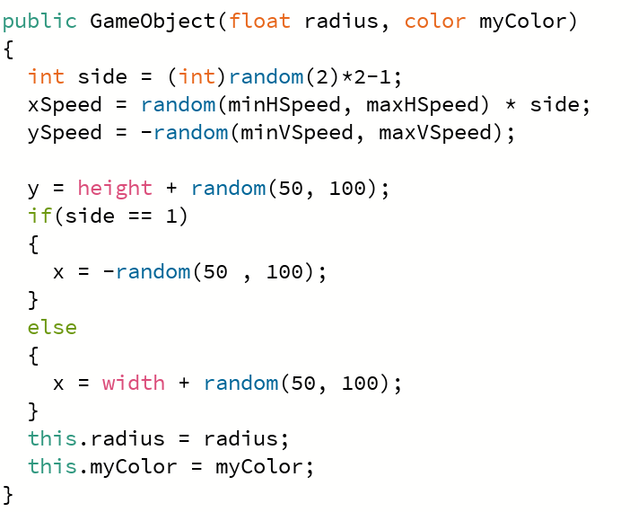

# Core Concepts 

## Make Real Games
Utilizing Processing, Unity and sometimes Unreal engine, we guide students through the process of making a tangible experience.

## With Real Code
We teach Java, Python, C#, C++ and JS. We usually choose our language based on the instructor and student(s) skill, however we can meet specific requests.

## And Real Math
Math is an essential focus for us, always improving students skills, and demonstrating why the math school teaches is useful and important and fascinating.

# Learning Goals

The following goals is what we hope students will be comfortable with at the end of our term.
Additionally, our learning goals vary with the overall general skill of the class, but the following are our primary objectives:

## General Code Skill
* Variables
* Images
* Functions
* Animations
* List vs Arrays
* Logic statements
* For Loops (forward and reverse)
* Basic Object-Oriented Programming 
* Code separation (Increase readability with strategic files)

## Math
* Basic Operations
* Vectors (Moving from point to point)
* Distance between two points
* (Possible) SOH CAH TOA (Used for rotation)

# Instructional Method
Students participate in Live Virtual Sessions through a video program called Zoom. 
These sessions are the primary form of learning, 
where an instructor guides the student through the course material. 
Our class sizes are limited to a maximum of 4 students per instructor and 
take place between 1-2 hours once per week at a scheduled time and Day.

Students also have access to our online resources through RP4K’s Canvas Portal.
Extra material in the form of quizzes, discussions, assignments, and other materials are
provided for additional learning outside of the Live Virtual Sessions. Previous course
recordings are uploaded and students can participate in class discussions or contact the
instructor with any questions they may have.

# Additional Notes:
**Installation needs to happen before the course starts.**
Please ensure that the student has the template installed and to keep GitHub desktop installed in case students would like to work in groups. Follow the installation guide below to get started and reach out if you have any questions at [our email info@realprogramming.com](mailto:info@realprogramming.com)!

You can view the code for BlackHole (Summer 2024 camp project) here: 

[BlackHole.pde](BlackHole/BlackHole.pde)

[GameObject.pde](BlackHole/GameObject.pde)

[Settings.pde](BlackHole/Settings.pde)
# Links

[Installation and Setup guide](https://docs.google.com/document/d/1l68CybTafnAKsQsMTc5M8fqCZZZ0au7lIT8ssTyRpw0/edit?usp=sharing)

[Website](https://realprogramming.com/)

